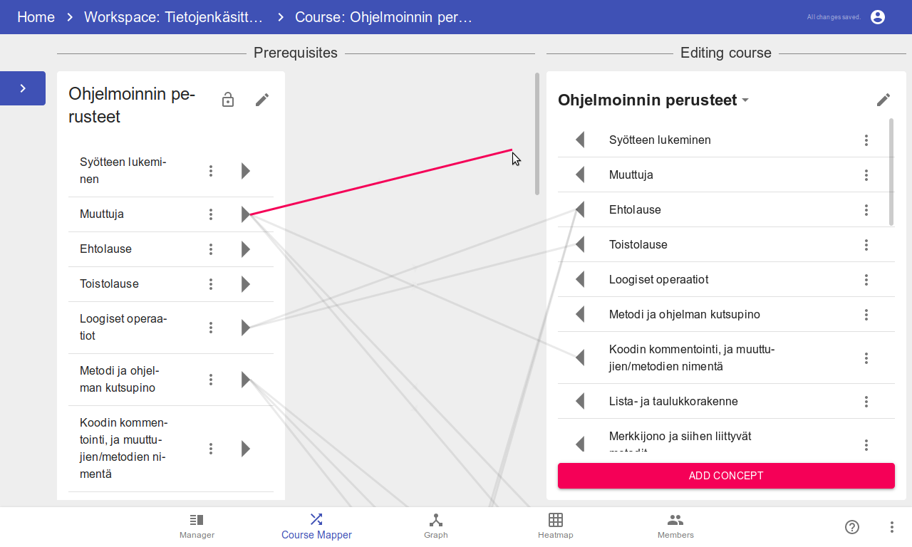
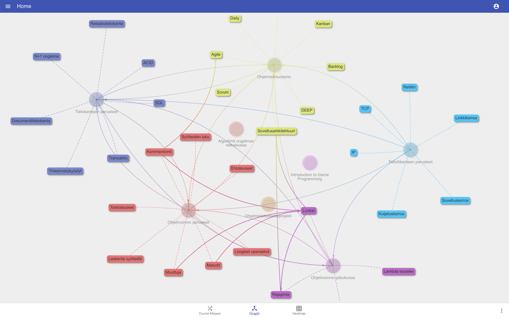

# Concepts

## Setting up a dev env
0. Clone the repo (`git clone https://github.com/rage/concepts.git`)
1. Install dependencies with `yarn` in both the `frontend` and `backend` directories.
2. Create `config/development.env` in the `backend` directory that contains
   `ENDPOINT=<your prisma backend>` and `SECRET=random string`. The prisma
   backend is usually `http://localhost:4466`.
3. Install [docker](https://docs.docker.com/install/) and [docker-compose](https://docs.docker.com/compose/install/).
4. Start the prisma backend with `docker-compose up -d` in the `backend` directory.
5. Start the backend with `yarn watch` in the `backend` directory.
6. Start the frontend dev server with `yarn start` in the `frontend` directory.

## Previews

### Concept mapper

### Concept graph

