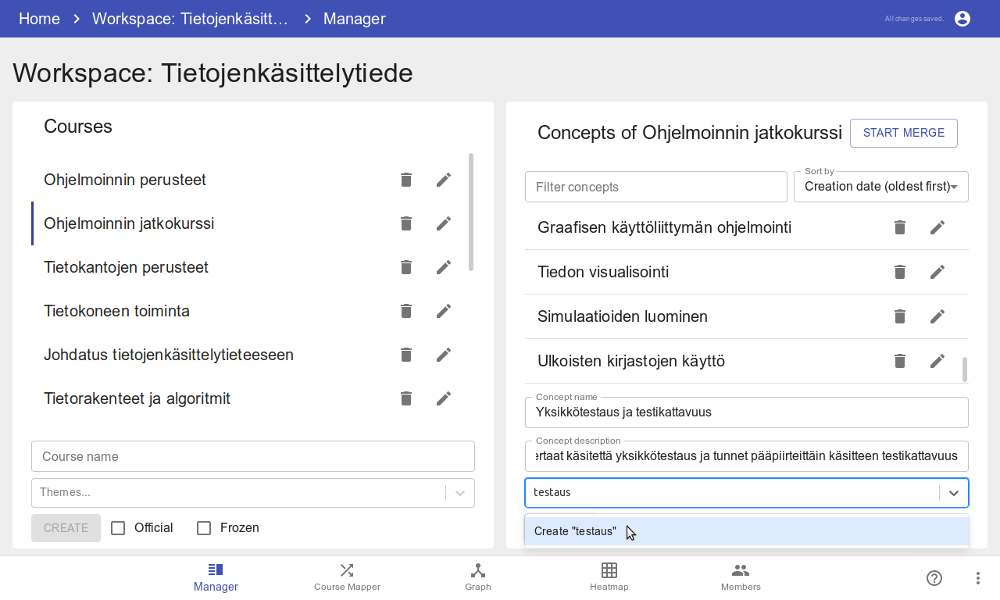
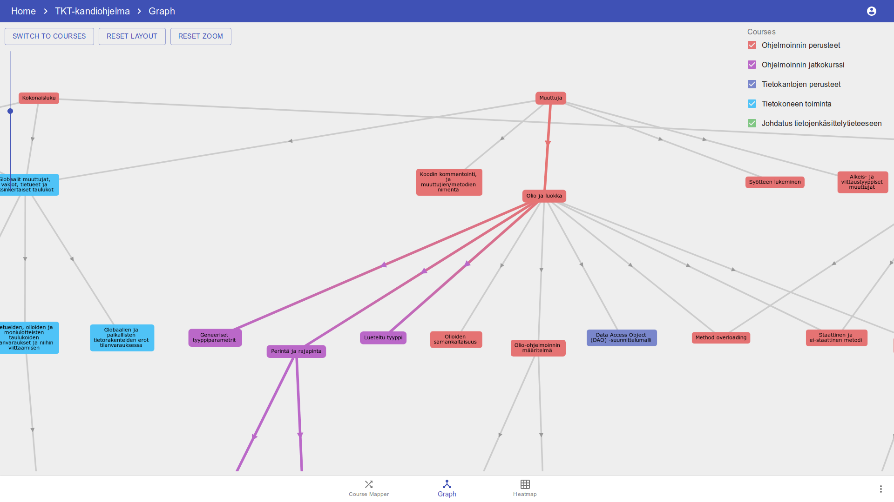

# Concepts

## Setting up a dev env
0. Clone the repo (`git clone https://github.com/rage/concepts.git`)
1. Install [docker](https://docs.docker.com/install/) and [docker-compose](https://docs.docker.com/compose/install/).
2. Build dev docker images with `./compose build`
3. Start everything with `./compose up -d`
4. Deploy the database with `./prisma deploy`
5. Go to http://localhost:8080 in your browser

## Previews

### Workspace manager

### Concept mapper

### Concept graph

### Workspace heatmap

